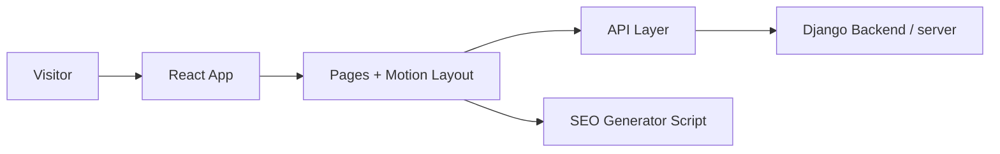

<p align="center">
  
</p>

<p align="center">
  <a href="https://github.com/awwwdde/pickupservice"></a>
  
  
  
  
</p>

<p align="center">
  
</p>

---

## Why This Project Feels Premium

`PickupService` is crafted like a digital showroom:

- cinematic hero transitions
- motion-led storytelling blocks
- sticky sections with depth and rhythm
- strong typography and contrast-driven visual language
- custom mobile behavior tuned for readability and performance

This is not just a website.  
It is a **brand experience layer** for an off-road workshop.

---

## Live Architecture



---

## Visual Stack

<p align="center">
  
</p>

### Frontend

- React 19
- TypeScript
- Vite 6
- Framer Motion
- Lenis
- Tailwind CSS 4
- React Router

### Backend (optional, `server/`)

- Django 5
- Django REST Framework
- django-cors-headers
- Pillow

---

## Routes

| Route | Purpose |
|---|---|
| `/` | Main landing experience |
| `/service` | Services presentation |
| `/portfolio` | Projects gallery |
| `/portfolio/:id` | Project detail page |
| `/contact` | Contact section |
| `/booking` | Booking form |

---

## Quick Start

```bash
npm install
npm run dev
```

Production build:

```bash
npm run build
npm run preview
```

Lint:

```bash
npm run lint
```

> `seo:generate` runs automatically before `dev`, `build`, and `preview`.

---

## Project Scripts

```json
{
  "dev": "vite",
  "build": "tsc -b && vite build",
  "preview": "vite preview",
  "lint": "eslint .",
  "seo:generate": "node ./scripts/generate-seo-files.mjs"
}
```

---

## Folder Blueprint

```text
pickupservice/
├─ src/
│  ├─ components/
│  │  ├─ header/
│  │  ├─ footer/
│  │  ├─ accordeoncard/
│  │  ├─ reviewcard/
│  │  └─ utils/
│  ├─ pages/
│  │  ├─ main.tsx
│  │  ├─ service.tsx
│  │  ├─ portfolio.tsx
│  │  ├─ project.tsx
│  │  ├─ contact.tsx
│  │  └─ booking.tsx
│  └─ api/
├─ scripts/
│  └─ generate-seo-files.mjs
└─ server/
   ├─ manage.py
   └─ README.md
```

---

## Motion & UX Notes

- Smooth-scroll effects are powered by `Lenis`.
- Route changes enforce scroll reset to top for predictable navigation.
- Mobile layouts are tuned to avoid text overlaps and preserve hierarchy.
- Header behavior adapts to background luminance for better contrast.

---

## Backend Setup (Optional)

```bash
cd server
python -m venv venv
venv\Scripts\activate
pip install -r requirements.txt
python manage.py migrate
python manage.py runserver
```

Details in `server/README.md`.

---

## Design Direction

If you want to keep the same visual quality while extending the app, follow this rule:

> **Typography first. Motion second. Effects last.**

Clean structure + smooth transitions + intentional accents (`#FF8201`) = the signature style.

---

<p align="center">
  
</p>
